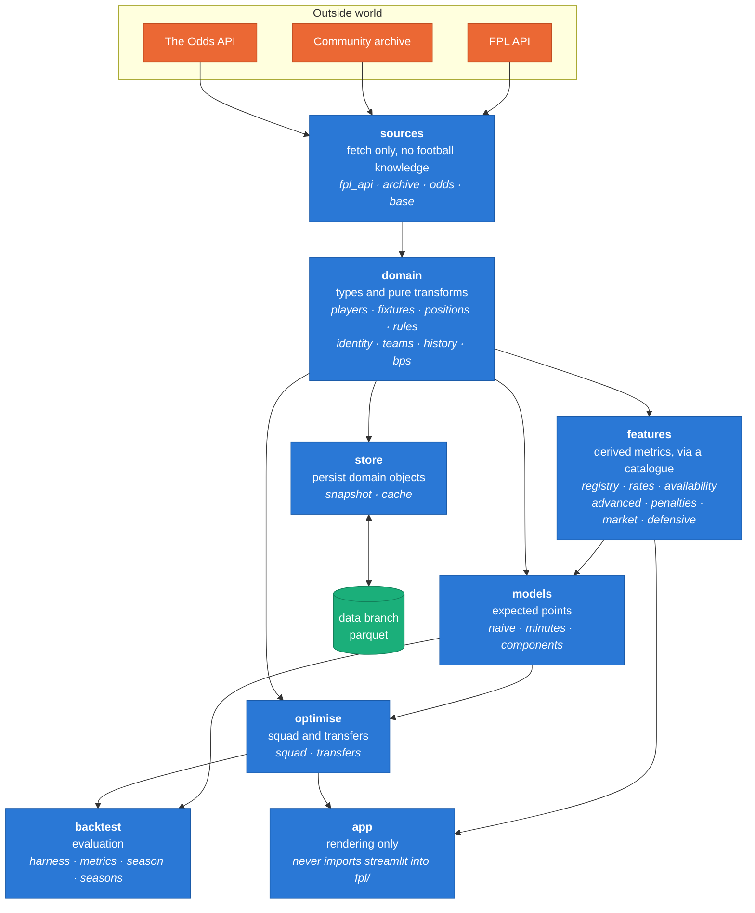
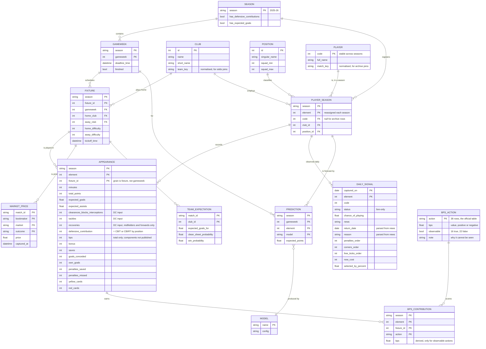

# Data model

Every dataset this project touches, what its grain and keys really are, and how
it should be persisted. Written after Phase 5, when the number of sources had
grown past the point where "a DataFrame from somewhere" was a workable answer.

**Companion document:** `docs/data-sources.md` maps every one of the 91
elements below to the source field it comes from, or the function that derives
it. It is generated from `fpl/domain/lineage.py` and checked against the live
feeds, so "can we actually get this?" has a tested answer for every field.

## The two facts that drive everything

**1. Half the data is live-only and disappears.** Injury status, set-piece
duty, price and ownership are published only for *now*. Nobody records them
retrospectively. If this project does not capture them daily, they are gone —
and no evaluation of them will ever be possible.

**2. Player identity is not stable.** `element` is reassigned every season.
`code` is stable but the historical archive does not carry it. So the archive
can only be joined to the present through normalised names, which is fuzzy and
occasionally ambiguous. Any model spanning seasons inherits that seam.

Everything below follows from those two.

## The architecture

Seven layers, each depending only on those below it. The rule is enforced by
`tests/test_architecture.py` rather than described here and hoped for — it
reads the imports and fails on any upward dependency.



### What each layer may not do

| Layer | Rule | Why |
|---|---|---|
| `sources` | must not import `domain` | a fetcher returns bytes; it does not know what a player is |
| `store` | persists domain objects, never fetches | separating these is what removed the old upward dependency |
| `domain` | must not import `models` | domain types should be usable without dragging a predictor in |
| `features` | one function per derivation, registered | so "where does this column come from" has an answer |
| `fpl/*` | must not import `streamlit` | the prime directive; tested |
| `app/*` | must not define derivations | arithmetic belongs in `features` |

Two of these were violations until this review. `canonical_position` lived in
`models/components.py`, so both `domain` and `features` imported *upwards* to
ask what a goalkeeper was — it now lives in `domain/positions.py`. And
`snapshot.py` sat in `sources` while fetching, transforming *and* writing,
which forced `sources` to import `domain`; splitting the writing into `store`
resolved it.

### Derivations are a catalogue, not a chain

Every derived column comes from a pure `frame -> frame` function. They were
previously hand-chained at the call site:

```python
players = add_scouting_metrics(load_players(), load_schedule())
return add_advanced_metrics(add_availability(players))
```

which is order-dependent, silently incomplete if one is forgotten, and gives
no answer to "where does `expected_penalty_goals` come from". `features/registry.py`
declares each derivation with what it requires and provides, so the whole set
applies in one call:

```python
result = enrich(players, rates={"schedule": schedule})
result.applied  # ['rates', 'availability', 'advanced', 'penalties']
result.skipped  # {} live; the live-only ones on an archive frame
```

Skipping is the important part. Availability and set-piece duty **do not exist**
for historical seasons, so applying the catalogue to an archive frame must
produce fewer columns rather than raising — or worse, inventing values.

## What exists today

### Sources — data that arrives from outside

| Dataset | From | Grain | Key | Volume | Lifetime |
|---|---|---|---|---|---|
| `bootstrap.elements` | FPL API | one row per player | `id` (= `element`) | 573 × 109 cols | **live only** |
| `bootstrap.teams` | FPL API | one row per club | `id` | 20 | live only |
| `bootstrap.element_types` | FPL API | one row per position | `id` | 4 | reference |
| `bootstrap.events` | FPL API | one row per gameweek | `id` | 38 | live only |
| `fixtures` | FPL API | one row per match | `id` | 380 | whole season |
| `element-summary.history` | FPL API | player × gameweek | `element`, `round` | empty pre-season | live only |
| `element-summary.history_past` | FPL API | player × season | `element_code`, `season_name` | ~5/player | stable |
| archive `merged_gw` | community | **player × fixture** | `element`, `fixture` | ~29k rows/season, ~12 MB | permanent |
| odds | The Odds API | bookmaker × market × outcome | `match_id`, `bookmaker`, `market`, `outcome` | ~10 rows/match | **live only** |

### Derived — computed, never fetched

| Dataset | Built by | Grain | Depends on |
|---|---|---|---|
| players (canonical) | `domain/players.py` | player | bootstrap |
| team schedule | `domain/fixtures.py` | **team × fixture** | fixtures + teams |
| gameweek history | `domain/history.py` | player × gameweek | element-summary |
| rates / value | `features/rates.py` | player | players + schedule |
| availability | `features/availability.py` | player | players |
| return date & reason | `features/availability.py` | player | players.news |
| set-piece duty, finishing | `features/advanced.py` | player | players |
| fixture outlook | `features/scouting.py` | player | players + schedule |
| market probabilities | `features/market.py` | **team × match** | odds |
| predictions | `models/*` | player × gameweek | history |
| squad / transfer plan | `optimise/*` | squad | predictions + rules |

### Reference — small, slow-moving, human-curated

| Dataset | Where | Why it is not just a constant |
|---|---|---|
| FPL rules | `domain/rules.py` | budget, squad shape, hit cost — change between seasons |
| position aliases | `domain/positions.py` | archive spells goalkeeper `GK` *and* `GKP` |
| team aliases | `domain/teams.py` | bookmakers say "Manchester United", FPL says "Man Utd" |
| numeric-string columns | `domain/players.py` | the API sends numbers as JSON strings |
| season capabilities | `backtest/seasons.py` | which seasons support which model |

### Persisted today

| Artifact | Format | Where | Grain |
|---|---|---|---|
| gameweek snapshot | parquet + json | `data` branch, `gw NN/` | player, overwritten per gameweek |
| daily signals | parquet | `data` branch, `daily/YYYY-MM-DD.parquet` | player × date, append-only, 56 KB/day |
| local cache | parquet | `data/cache/`, gitignored | varies, disposable |
| watchlist | json | `data/`, gitignored | player `code` |
| model results | markdown | `docs/` | committed so numbers diff |

## The model



### Things the diagram is asserting

**`APPEARANCE` is keyed on fixture, not gameweek.** A double gameweek gives a
player two appearances in one gameweek, and keying on gameweek silently merges
them. Measured on the real archive: 29,747 unique `(element, fixture)` against
29,338 unique `(element, gameweek)`.

**`PLAYER` and `PLAYER_SEASON` are separate.** `element` belongs to a season;
`code` identifies the human. The archive has only `element`, so archive rows
join to `PLAYER` through `match_key` and may fail — which is why `code` is
nullable on `PLAYER_SEASON` rather than required.

**`SEASON` carries capability flags.** Defensive contributions exist from
2025-26 and expected goals from 2022-23. A season is not just a label, it is a
statement about which rules were in force, and pooling seasons without checking
compares models at different games.

**`DAILY_SIGNAL` is the only append-only table.** Everything else can be
rebuilt from its source; this one cannot be rebuilt at all.

**`BPS_ACTION` is reference data, and it records what we cannot see.** Most
reference tables list what exists; this one also carries `observable`, because
the 22 unobservable actions are the reason a bonus model has a ceiling. It is
exposed as a frame by `bps.action_table()` so "which scoring actions are
invisible, and what are they worth" is a query rather than a docstring.

**`BPS_CONTRIBUTION` is derived and deliberately unpersisted.** It is what
`reconstruct()` computes on the fly; storing it would create a second thing to
go stale, and it is only ever partial.

## Scoring inputs: what the model must capture

Two scoring routes reward the same kind of work and differ in one decisive
way — one is fully recoverable from published data and the other is not.

### Defensive contributions — recoverable, and verified

Two points for clearing a threshold of defensive actions in a match:

| Position | Counts | Threshold |
|---|---|---|
| Defender | clearances + blocks + interceptions + tackles (**CBIT**) | 10 |
| Midfielder / Forward | the same **plus recoveries** (**CBIRT**) | 12 |
| Goalkeeper | not eligible | — |

The API publishes both the components and the total they sum to, so the
identity can be *checked* rather than assumed. Verified on all of 2025-26:

- 3,950 defender appearances — `defensive_contribution == CBIT` on **100.0%**
- 6,775 midfield and forward appearances — `== CBIRT` on **100.0%**

`fpl/features/defensive.py` computes it and exposes `formula_agreement()` as a
standing data-quality check. It should be 1.0; anything less means the rule
changed or the inputs stopped meaning what they meant.

The model therefore stores the three component columns *as well as* the
published total. Keeping only the total would leave the threshold
un-recomputable if the rule changes, and keeping only the components would
remove the check.

Across 2025-26: 12.3% of appearances cleared the threshold, worth 2,834 points.

### BPS — 16 of 38 actions observable

The API publishes `bps` as a **total**, never its components. The official
table (Premier League, 2025-26) has 38 scoring actions; the API gives us the
inputs for 16. `fpl/domain/bps.py` records all 38 — including the ones we
cannot see, because knowing that a big chance created is worth 3 tells you
*which kind of player* this project will systematically under-rate.

| Observable (16) | Not published (22) |
|---|---|
| appearance 3 / 6 | key pass 1, big chance created 3 |
| goal 12 / 18 / 24 by position | successful cross 1, dribble 1 |
| assist 9, clean sheet 12 | shot on target 2, off target −1 |
| penalty save 8, tackle 2 | pass completion 2 / 4 / 6 |
| CBI 1 per 2, recoveries 1 per 3 | goalline clearance 9, foul won 1 |
| goal conceded −4, cards −3 / −9 | big chance missed −3, error −3 / −1 |
| own goal −6, missed penalty −6 | conceded penalty −3, offside −1 |

`reconstruct()` applies the **official coefficients** to the available inputs —
deliberately unfitted, so what is left over measures the missing data rather
than a model's inability. Measured on 2025-26:

| | |
|---|---|
| Correlation with published BPS | **0.908** |
| Share of total BPS accounted for | **87.0%** |
| R² (unfitted) | **0.805** |
| Median per-appearance gap | +1 |

Notably the unfitted reconstruction beats a fitted regression on the same
columns (R² 0.805 against 0.761). The published rules are exact, and fitting
throws away structure the rules encode — per-2 integer division on clearances,
the position-dependent goal values.

The reconstruction under-counts in 52% of appearances, as expected: the
unobservable actions are overwhelmingly positive. It also *over*-counts
occasionally, which is informative — penalties now score 12 for every position
while the API reports only `goals_scored`, so a midfielder's penalty is
credited 18 instead of 12. That is the "no penalty/open-play split" limitation
showing up as a number.

**This is a ceiling, not a gap to close.** A bonus model built on this data
sees about seven-eighths of BPS and should be described that way.

### Where the BPS inputs live

All 15 observable inputs are in the archive and the live API. The daily capture
now carries them too, as season-to-date totals:

| Layer | Coverage | Why |
|---|---|---|
| archive `merged_gw` | all 15, per fixture | the modelling substrate |
| live `bootstrap` | all 15, season to date | what the app renders |
| daily capture | all 15, season to date | **so per-gameweek values can be recovered by differencing** |

That last row is the point of adding them. Differencing consecutive daily
captures reproduces per-gameweek stats without the community archive, which is
a third-party mirror that could stop being maintained at any time. It costs
about 5 MB a season — 41 KB/day to 56 KB/day — to stop depending on it for the
most important data in the project.

## Penalties: sources reviewed

A penalty is the closest thing to a free goal in football and it accrues to
one player per team, which makes penalty duty unusually valuable — and
unusually badly served by the data.

| Source | Penalties scored | Designated taker | Usable | robots.txt |
|---|---|---|---|---|
| FPL API | **no** | `penalties_order` | yes, **live only** | n/a |
| community archive | no — misses and saves only | no | partly | n/a |
| **myfootballfacts.com** | **yes, per player** | no | **permitted, unused** | `Allow: /` |
| theanalyst.com (Opta) | aggregate articles only | no | permitted | `Allow: /` |
| FBref | yes — PK, PKatt, npxG | no | **no** | 403 Cloudflare |
| Understat | yes — npxG | no | **no** | `Disallow: /` |

**Nobody this project can currently read publishes penalties scored.**
`goals_scored` includes them and `expected_goals` includes penalty xG, so a
taker's underlying numbers are inflated in a way that cannot be separated out.
That is also the largest known distortion in the BPS reconstruction: penalties
score 12 BPS for every position, but a midfielder's is credited 18 because only
the goal is visible.

`myfootballfacts.com` is the one permitted source that publishes per-player
penalties. It is recorded here rather than used — one more scraper is a cost,
and the daily captures may make it unnecessary.

### Why the taker probability is assumed, not measured

The obvious empirical route is to look at who has missed penalties and read off
their `penalties_order`. It does not work: `penalties_order` is **live-only and
never archived**, so today's order describes *this* season while
`penalties_missed` describes *last* one. Comparing them measures squad churn.

The daily captures now record `penalties_order`, so a season of them makes this
estimable for the first time. Until then the shares live in one constant so
replacing assumption with measurement is a one-line change.

### Base rates, and a check on them

Published: ~**0.25 penalties scored per match** (2023/24), conversion 89.7% that
season and **81.9% across 2020/21–2023/24**.

Checked against this project's own data: 2025-26 recorded 15 missed and 11
saved, so 26 failures. With 0.25 scored per match over 380 matches that implies
**~121 attempts, 78.5% conversion, 0.32 penalties awarded per match** — inside
the published range, which is as much validation as is available without a feed
that publishes attempts.

The estimate is sensitive to the assumed conversion, which is the honest
caveat: at 89.7% the same 26 failures would imply 252 attempts, which is
implausible.

## Options for managing it

Measured, not guessed: four seasons of archive is ~45 MB in memory and ~12 MB
on disk as parquet; a daily capture is 34 KB, about 10 MB a season.

| Option | Fit | Verdict |
|---|---|---|
| **Parquet files on the `data` branch** | free, versioned, point-in-time by construction, no infrastructure | **Current, and correct for now** |
| **Add DuckDB as a read layer** over those parquet files | SQL across seasons without loading everything into pandas; reads parquet directly; single dependency, no server | **Recommended next**, when a query spans seasons |
| DuckDB as the *storage* format | one binary file rewritten on every change — terrible in git | Rejected |
| SQLite | same git problem, and worse at columnar scans | Rejected |
| Supabase / hosted Postgres | proper concurrency and a real query planner | Premature: no concurrent writers, 22 MB total, adds credentials and a failure mode |
| Actions artifacts | 90-day retention | Disqualified — that is not persistence |
| Parquet in cloud object storage (R2/S3) | scales past git comfortably | Worth it only past ~1 GB, which is years away |

### The recommendation

1. **Keep parquet on the `data` branch.** At 10 MB a season it will be years
   before git objects to it, and the version history is a genuine feature: you
   can see what changed about a player on a given day.
2. **Add DuckDB as a query layer when, and only when, a question spans
   seasons.** It reads the parquet in place, so it changes nothing about how
   data is written and can be removed as easily as it is added.
3. **Partition by season and date** — already the layout — so a query touches
   only what it needs.
4. **Never persist derived data.** Everything under `features/` and `models/`
   is a pure function of the sources; storing it creates a second thing that
   can be stale, and recomputation is measured in milliseconds.
5. **Write a schema check before the volume gets interesting.** The archive
   silently changed column count between seasons (43 → 51) and contains exact
   duplicate rows. A contract test over the persisted files is the cheap
   version of a database constraint.

## Known data quality issues

| Issue | Where | Handling |
|---|---|---|
| Exact duplicate appearances | archive, ≥1 player/season | Deduplicated on `(element, fixture)` at the source boundary. Left alone this inflated one player's season from 113 points to 140. |
| Column count varies by season | archive, 43–51 columns | `season_capabilities()` reports what each supports |
| Older seasons are latin-1 | archive, 2016-17 to 2019-20 | Encoding fallback in `_read_csv` |
| No `code` in the archive | archive | Name matching, with collisions reported not guessed |
| Numbers sent as JSON strings | FPL API | Coerced at the boundary |
| `chance_of_playing` null means "no news" | FPL API | `status` is the authority |
| Corner order starts at 2, not 1 | FPL API | First choice = lowest order per club |
