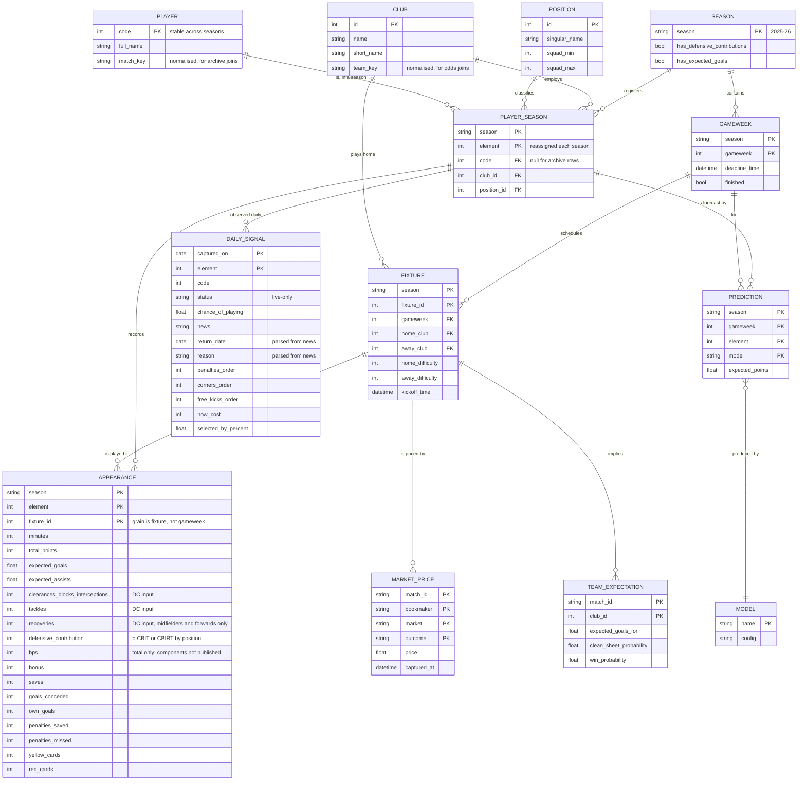

# Data model

Every dataset this project touches, what its grain and keys really are, and how
it should be persisted. Written after Phase 5, when the number of sources had
grown past the point where "a DataFrame from somewhere" was a workable answer.

## The two facts that drive everything

**1. Half the data is live-only and disappears.** Injury status, set-piece
duty, price and ownership are published only for *now*. Nobody records them
retrospectively. If this project does not capture them daily, they are gone —
and no evaluation of them will ever be possible.

**2. Player identity is not stable.** `element` is reassigned every season.
`code` is stable but the historical archive does not carry it. So the archive
can only be joined to the present through normalised names, which is fuzzy and
occasionally ambiguous. Any model spanning seasons inherits that seam.

Everything below follows from those two.

## What exists today

### Sources — data that arrives from outside

| Dataset | From | Grain | Key | Volume | Lifetime |
|---|---|---|---|---|---|
| `bootstrap.elements` | FPL API | one row per player | `id` (= `element`) | 573 × 109 cols | **live only** |
| `bootstrap.teams` | FPL API | one row per club | `id` | 20 | live only |
| `bootstrap.element_types` | FPL API | one row per position | `id` | 4 | reference |
| `bootstrap.events` | FPL API | one row per gameweek | `id` | 38 | live only |
| `fixtures` | FPL API | one row per match | `id` | 380 | whole season |
| `element-summary.history` | FPL API | player × gameweek | `element`, `round` | empty pre-season | live only |
| `element-summary.history_past` | FPL API | player × season | `element_code`, `season_name` | ~5/player | stable |
| archive `merged_gw` | community | **player × fixture** | `element`, `fixture` | ~29k rows/season, ~12 MB | permanent |
| odds | The Odds API | bookmaker × market × outcome | `match_id`, `bookmaker`, `market`, `outcome` | ~10 rows/match | **live only** |

### Derived — computed, never fetched

| Dataset | Built by | Grain | Depends on |
|---|---|---|---|
| players (canonical) | `domain/players.py` | player | bootstrap |
| team schedule | `domain/fixtures.py` | **team × fixture** | fixtures + teams |
| gameweek history | `domain/history.py` | player × gameweek | element-summary |
| rates / value | `features/rates.py` | player | players + schedule |
| availability | `features/availability.py` | player | players |
| return date & reason | `features/availability.py` | player | players.news |
| set-piece duty, finishing | `features/advanced.py` | player | players |
| fixture outlook | `features/scouting.py` | player | players + schedule |
| market probabilities | `features/market.py` | **team × match** | odds |
| predictions | `models/*` | player × gameweek | history |
| squad / transfer plan | `optimise/*` | squad | predictions + rules |

### Reference — small, slow-moving, human-curated

| Dataset | Where | Why it is not just a constant |
|---|---|---|
| FPL rules | `domain/rules.py` | budget, squad shape, hit cost — change between seasons |
| position aliases | `models/components.py` | archive spells goalkeeper `GK` *and* `GKP` |
| team aliases | `domain/teams.py` | bookmakers say "Manchester United", FPL says "Man Utd" |
| numeric-string columns | `domain/players.py` | the API sends numbers as JSON strings |
| season capabilities | `backtest/seasons.py` | which seasons support which model |

### Persisted today

| Artifact | Format | Where | Grain |
|---|---|---|---|
| gameweek snapshot | parquet + json | `data` branch, `gw NN/` | player, overwritten per gameweek |
| daily signals | parquet | `data` branch, `daily/YYYY-MM-DD.parquet` | player × date, append-only |
| local cache | parquet | `data/cache/`, gitignored | varies, disposable |
| watchlist | json | `data/`, gitignored | player `code` |
| model results | markdown | `docs/` | committed so numbers diff |

## The model

### Things the diagram is asserting

**`APPEARANCE` is keyed on fixture, not gameweek.** A double gameweek gives a
player two appearances in one gameweek, and keying on gameweek silently merges
them. Measured on the real archive: 29,747 unique `(element, fixture)` against
29,338 unique `(element, gameweek)`.

**`PLAYER` and `PLAYER_SEASON` are separate.** `element` belongs to a season;
`code` identifies the human. The archive has only `element`, so archive rows
join to `PLAYER` through `match_key` and may fail — which is why `code` is
nullable on `PLAYER_SEASON` rather than required.

**`SEASON` carries capability flags.** Defensive contributions exist from
2025-26 and expected goals from 2022-23. A season is not just a label, it is a
statement about which rules were in force, and pooling seasons without checking
compares models at different games.

**`DAILY_SIGNAL` is the only append-only table.** Everything else can be
rebuilt from its source; this one cannot be rebuilt at all.

## Scoring inputs: what the model must capture

Two scoring routes reward the same kind of work and differ in one decisive
way — one is fully recoverable from published data and the other is not.

### Defensive contributions — recoverable, and verified

Two points for clearing a threshold of defensive actions in a match:

| Position | Counts | Threshold |
|---|---|---|
| Defender | clearances + blocks + interceptions + tackles (**CBIT**) | 10 |
| Midfielder / Forward | the same **plus recoveries** (**CBIRT**) | 12 |
| Goalkeeper | not eligible | — |

The API publishes both the components and the total they sum to, so the
identity can be *checked* rather than assumed. Verified on all of 2025-26:

- 3,950 defender appearances — `defensive_contribution == CBIT` on **100.0%**
- 6,775 midfield and forward appearances — `== CBIRT` on **100.0%**

`fpl/features/defensive.py` computes it and exposes `formula_agreement()` as a
standing data-quality check. It should be 1.0; anything less means the rule
changed or the inputs stopped meaning what they meant.

The model therefore stores the three component columns *as well as* the
published total. Keeping only the total would leave the threshold
un-recomputable if the rule changes, and keeping only the components would
remove the check.

Across 2025-26: 12.3% of appearances cleared the threshold, worth 2,834 points.

### BPS — only three-quarters recoverable

The API publishes `bps` as a **total**, never its components. Fitting every
published stat against it across a full season leaves **24% of its variance
unexplained**.

| Available and correlated | Not published at all |
|---|---|
| minutes, goals, assists, clean sheets, saves | passes completed, key passes |
| CBI, tackles, recoveries | big chances created / missed |
| cards, own goals, penalties, goals conceded | errors leading to a goal |
| | successful dribbles, fouls, offsides |

That 24% is a **ceiling, not a gap to close** — no modelling recovers a
component nobody publishes. A bonus-points model built on this data is roughly
three-quarters informed and should be described that way. The figure is
recorded as `BPS_EXPLAINED_SHARE` so the claim is checkable rather than folklore.

## Options for managing it

Measured, not guessed: four seasons of archive is ~45 MB in memory and ~12 MB
on disk as parquet; a daily capture is 34 KB, about 10 MB a season.

| Option | Fit | Verdict |
|---|---|---|
| **Parquet files on the `data` branch** | free, versioned, point-in-time by construction, no infrastructure | **Current, and correct for now** |
| **Add DuckDB as a read layer** over those parquet files | SQL across seasons without loading everything into pandas; reads parquet directly; single dependency, no server | **Recommended next**, when a query spans seasons |
| DuckDB as the *storage* format | one binary file rewritten on every change — terrible in git | Rejected |
| SQLite | same git problem, and worse at columnar scans | Rejected |
| Supabase / hosted Postgres | proper concurrency and a real query planner | Premature: no concurrent writers, 22 MB total, adds credentials and a failure mode |
| Actions artifacts | 90-day retention | Disqualified — that is not persistence |
| Parquet in cloud object storage (R2/S3) | scales past git comfortably | Worth it only past ~1 GB, which is years away |

### The recommendation

1. **Keep parquet on the `data` branch.** At 10 MB a season it will be years
   before git objects to it, and the version history is a genuine feature: you
   can see what changed about a player on a given day.
2. **Add DuckDB as a query layer when, and only when, a question spans
   seasons.** It reads the parquet in place, so it changes nothing about how
   data is written and can be removed as easily as it is added.
3. **Partition by season and date** — already the layout — so a query touches
   only what it needs.
4. **Never persist derived data.** Everything under `features/` and `models/`
   is a pure function of the sources; storing it creates a second thing that
   can be stale, and recomputation is measured in milliseconds.
5. **Write a schema check before the volume gets interesting.** The archive
   silently changed column count between seasons (43 → 51) and contains exact
   duplicate rows. A contract test over the persisted files is the cheap
   version of a database constraint.

## Known data quality issues

| Issue | Where | Handling |
|---|---|---|
| Exact duplicate appearances | archive, ≥1 player/season | Deduplicated on `(element, fixture)` at the source boundary. Left alone this inflated one player's season from 113 points to 140. |
| Column count varies by season | archive, 43–51 columns | `season_capabilities()` reports what each supports |
| Older seasons are latin-1 | archive, 2016-17 to 2019-20 | Encoding fallback in `_read_csv` |
| No `code` in the archive | archive | Name matching, with collisions reported not guessed |
| Numbers sent as JSON strings | FPL API | Coerced at the boundary |
| `chance_of_playing` null means "no news" | FPL API | `status` is the authority |
| Corner order starts at 2, not 1 | FPL API | First choice = lowest order per club |
